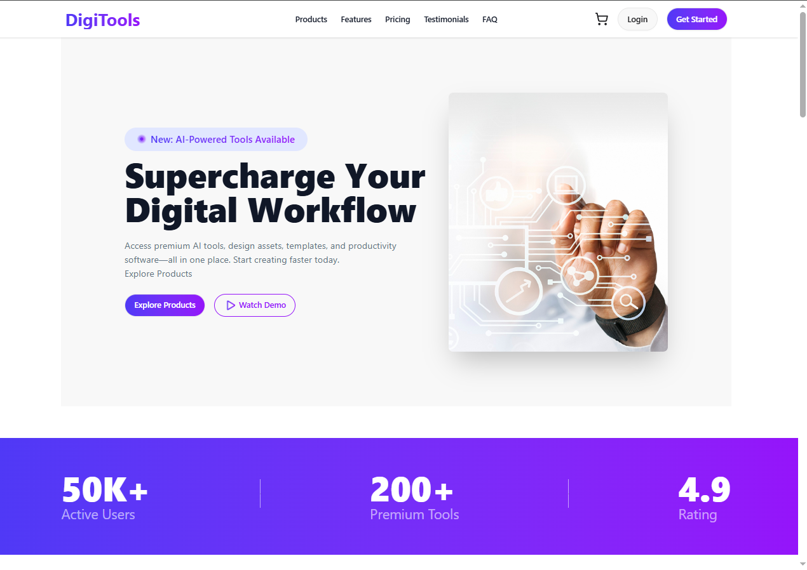
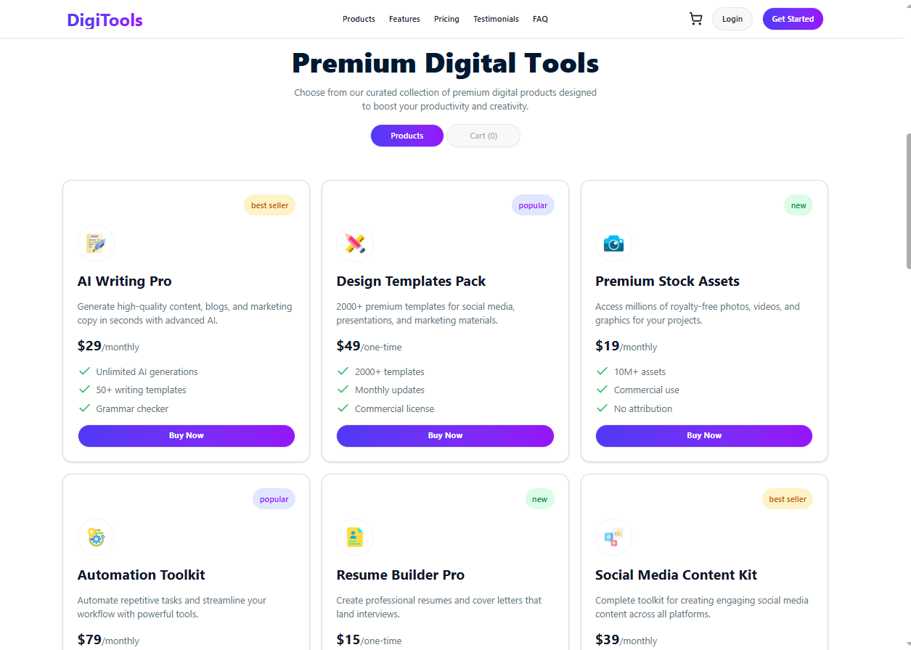
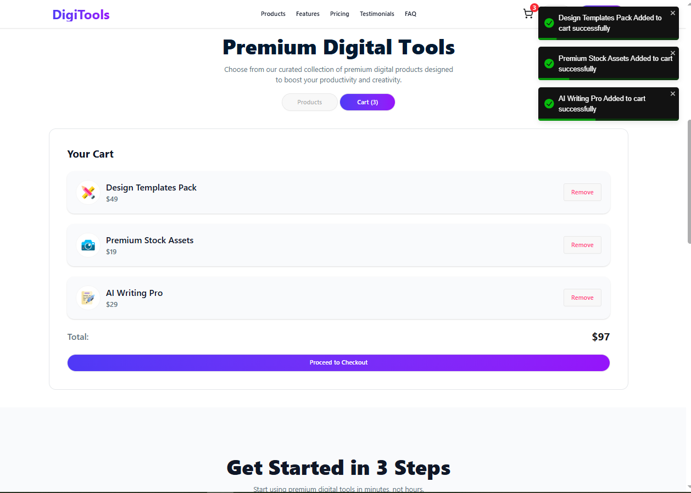

# 🛠️ DigiTools Platform

A modern digital tools marketplace built with React, where users can browse, select, and purchase a variety of productivity and design tools. The platform offers a clean, responsive interface with real-time cart management and smooth user interactions.

---

## 🚀 Live Demo

🌐 **Live Site:** [https://assignment-6-digitools-plat-form.netlify.app/](https://assignment-6-digitools-plat-form.netlify.app/)

📁 **GitHub Repository:** [https://github.com/rashedulislam595/Assignment-6-digitools-platform](https://github.com/rashedulislam595/Assignment-6-digitools-platform)

---

## 📖 Overview

DigiTools Platform is a single-page e-commerce style application for discovering and purchasing digital tools. Users can explore a catalog of tools displayed in a responsive grid, add items to their cart, view their cart summary, and proceed to checkout — all within a smooth, notification-driven UI experience.

---

## ⚙️ Technologies Used

| Technology | Purpose |
|---|---|
| **React.js** | UI component architecture & state management |
| **Tailwind CSS** | Utility-first styling |
| **DaisyUI** | Pre-built Tailwind component library |
| **JavaScript (ES6+)** | Core application logic |
| **React Toastify** | Toast notifications for user actions |
| **JSON** | Local product data storage |
| **Vite** | Development build tool |

---

## ✨ Key Features

- **📦 Product Catalog** — Browse 6–10 digital tools displayed in a responsive 3-column grid, each showing name, description, pricing, billing period, tags, features list, and icon.
- **🛒 Cart Management** — Add products to a cart, view a running total, remove individual items, and clear all items via "Proceed to Checkout". The navbar reflects a live cart item count.
- **🔔 Toast Notifications** — Instant feedback using React Toastify on every cart action — add to cart, item removal, and checkout confirmation.

---

## 📦 Dependencies

```json
{
  "dependencies": {
    "react": "^18.x",
    "react-dom": "^18.x",
    "react-toastify": "^10.x"
  },
  "devDependencies": {
    "vite": "^5.x",
    "@vitejs/plugin-react": "^4.x",
    "tailwindcss": "^3.x",
    "daisyui": "^4.x",
    "autoprefixer": "^10.x",
    "postcss": "^8.x"
  }
}
```

---

## 🖥️ Running the Project Locally

Follow these steps to run DigiTools Platform on your local machine:

### Prerequisites

Make sure you have the following installed:
- [Node.js](https://nodejs.org/) (v18 or higher recommended)
- [Git](https://git-scm.com/)

### Steps

**1. Clone the repository**
```bash
git clone https://github.com/rashedulislam595/Assignment-6-digitools-platform.git
```

**2. Navigate into the project directory**
```bash
cd YOUR_REPO_NAME
```

**3. Install dependencies**
```bash
npm install
```

**4. Start the development server**
```bash
npm run dev
```

**5. Open in browser**

Visit `http://localhost:5173` (or the port shown in your terminal) to view the app.

### Build for Production

```bash
npm run build
```

The production-ready files will be output to the `dist/` folder.

---

## 📁 Project Structure

```
src/
├── assets/          # Images and static files
├── components/      # Reusable UI components
│   ├── Navbar/
│   ├── Banner/
│   ├── ProductCard/
│   ├── Cart/
│   ├── Stats/
│   ├── Steps/
│   ├── Pricing/
│   └── Footer/
├── data/
│   └── products.json   # Product catalog data
├── App.jsx
└── main.jsx
```

---

## 📸 Screenshots





---

## 👤 Author

**Rashedul Islam**
- GitHub: [@rashedulislam595](https://github.com/rashedulislam595)
